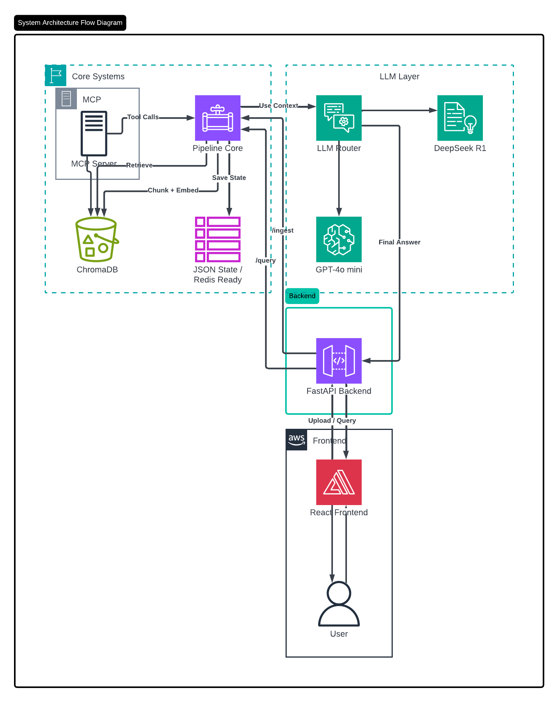

# 🧠 RAG Pipeline

**Drop in your documents. Ask anything. Get cited answers.**

A local RAG system that lets you chat with your own PDFs, markdown, and text files — with source citations, conversation memory, and a clean React UI. Everything runs on your machine.



---

## Features

- 📄 **Smart chunking** — splits documents at headings or semantic boundaries, not arbitrary character limits
- 🔍 **Intent-aware retrieval** — understands if you're asking a fact, requesting a summary, or comparing sections
- 💬 **Conversation memory** — remembers context across turns, compresses history when it fills up
- 💰 **Cost-efficient LLM routing** — DeepSeek for internal tasks, GPT-4o mini for answers
- ♻️ **Crash-safe ingestion** — resumes exactly where it left off if something goes wrong
- 🔌 **MCP support** — works as a tool with any MCP-compatible AI agent

---

## Stack

`FastAPI` · `ChromaDB` · `React + Vite` · `SentenceTransformers` · `OpenRouter`

---

## Setup

**1. Clone the repo**
```bash
git clone <your-repo-url>
cd <project-folder>
```

**2. Create a virtual environment and install dependencies**
```bash
python -m venv .venv

# Windows
.\.venv\Scripts\activate

# macOS/Linux
source .venv/bin/activate

pip install -r requirements.txt
```

**3. Add your OpenRouter API key**

Create a `.env` file in the root:
```env
OPENROUTER_API_KEY=your_key_here
```

**4. Install frontend dependencies**
```bash
cd frontend
npm install
cd ..
```

---

## Running

You need two terminals open at the same time.

**Backend:**
```bash
# Windows
.\.venv\Scripts\python.exe -m uvicorn backend.main:app --reload --port 8000

# macOS/Linux
.venv/bin/python -m uvicorn backend.main:app --reload --port 8000
```

**Frontend:**
```bash
cd frontend
npm run dev
```

Open `http://localhost:5173` and you're good to go.

---

## License

MIT